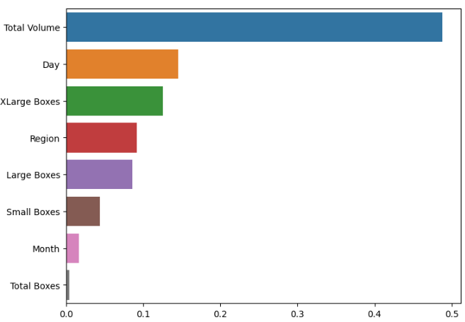

## Predicting Kimchi Prices

Various machine learning techniques were employed to accurately predict the prices of kimchi. The methodological approach to building the model is delineated below:

---

### 1. **Data Analysis**

#### Overview:
- **Non-null Count**: 
  - 4 missing entries were detected in the 'Price' column.
  - 1 missing entry in the 'Total Volume' column.
- **Data Order**: The dataset wasn't chronologically ordered by date.
- **Outliers**: Multiple outliers became evident during the exploratory analysis.
- **Feature Scales**: A disparity in feature scales was noticed, prompting the need for feature scaling.

---

### 2. **Data Preprocessing**

#### Steps Undertaken:
- **Sorting**: The dataset was chronologically arranged by date.
- **Handling Missing Values**: Advanced statistical imputation methods were employed to address and fill the missing data.
- **Outliers**: The IQR method was adopted to effectively manage and filter out outliers.
- **Feature Scaling**: Log scaling was strategically applied to harmonize the feature distributions.
- **Data Splitting**: An 80:20 split ratio was used to segregate the dataset into training and testing sets.

---

### 3. **Model Training**

A suite of regression models was rigorously tested to ascertain the optimal fit:
- **Ridge Regression**: Specifically employed to manage multicollinearity and mitigate overfitting.
- **Decision Tree Regression**: A holistic non-parametric approach.
- **Random Forest Regression**: Tapped into ensemble learning for improved generalization.
- **Support Vector Regression (SVM)**: Provided a nuanced alternative to conventional regression models.

---

### 4. **Model Selection**

A robust model selection was anchored on:
- **KFold Cross Validation**: This was instrumental in curtailing overfitting and ensuring the model's generalizability.
- **R squared**: This metric was pivotal in assessing the variance explained by the model.

Based on comprehensive testing, the **Random Forest Regression** was selected for its stellar performance. Specifically, the average cross-validation score stood at 0.7227 while the R-squared value on train data was an impressive 0.9268.

---

### 5. **Model Evaluation**

The final model underwent a detailed evaluation using:
- **Mean Absolute Error (MAE)**: This presented the average error magnitude.
- **Mean Squared Error (MSE)**: This metric emphasized larger prediction errors.
- **Root Mean Squared Error (RMSE)**: A metric that's easily interpretable in the target's original units.
- **R squared**: Captured the proportion of target variance explained by predictors.

The **Random Forest** model's scores were as follows:
- **MAE**: 0.1127
- **MSE**: 0.02272
- **RMSE**: 0.15073
- **R squared**: 0.5045

For a holistic perspective, comparison scores from other models are meticulously documented in the attached notebook.

---

### 6. **Model Visualization**

Advanced visualization techniques were leveraged to offer deep insights into the model's decision-making process. This visualization laid bare the relative importance of each feature in the prediction.

---

### 7. **Conclusion**

Following systematic data preprocessing, rigorous model training, and thorough evaluation, the Random Forest Regression model emerged as the most apt for predicting kimchi prices. This model not only yields precise predictions but also sheds light on the determinants of kimchi prices. 